# ColorfulOptionsetGrid

The family of ColorfulOptionset Controls has a new member: ColorfulOptionsetGrid. Using this control, you can show the OptionsSets using the colors customized using the standard experience.
The Grid is not limited to showing the color "with a dot". You can choose from different possibities: with/no icon of your choice, whowing a border or a filled box.

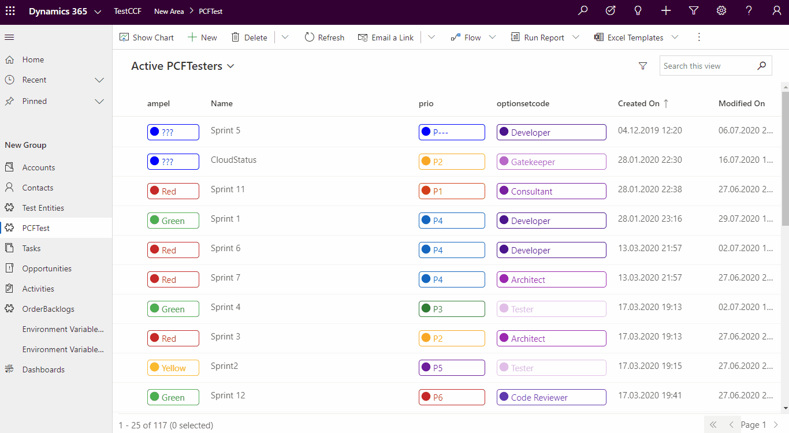

For now the control is only for ModelDriven apps, but as soon the CanvasAPps geht more stable, I intend to extend the control.

## Customizing
The most important parameters are:
-  **Display text type** - here you can choose if you would lile top have the text displayed 
    - "Colorful Border": as a colorful border 
    - "Colorful background": with colorful background
    - "No decoration": a text should have no styles
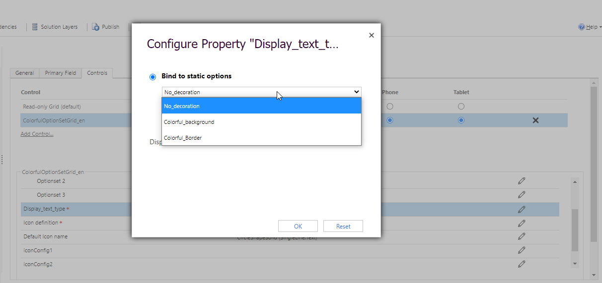

- **Icon definition** - here you can choose how the icon should be displayed
    - "No icon" : the icon won't be displayed
    - "Icon name or JSON": the content can be the fiendly name of an icon from FluentUI Icons. You nay choose from here: https://uifabricicons.azurewebsites.net/
    Another possibility for this paramerter is having JSON objects containing "icon" and/or "color" for each option. For mor details see the section "JSON definition" below.
    To be able to use this parameter, you havce to configure the columns you want to have displayed. See the configuration possibilities below.
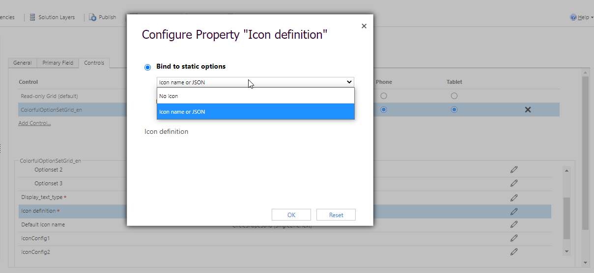

- **Default icon name** - The name of an Icon from FluentUI which will be used when nothing else was defined (or when there is a special definition (JSON), but the icon for the value is missing). The default value is "the dot": "CircleShapeSolid".

If you need more control, you can define up to 3 columns which should be displayed "colorful" (optionset1, optionset2, optionset3 ). For each of them you can specify the values "iconConfig1", "iconConfig2", "iconConfig3" (the number of the config is corresponding to the optionset number)

## Customizing possibilities:

### Default  - all OptionSets as Icons
The default is showing the "Dots" for all the columns that are of type "OptionSet".
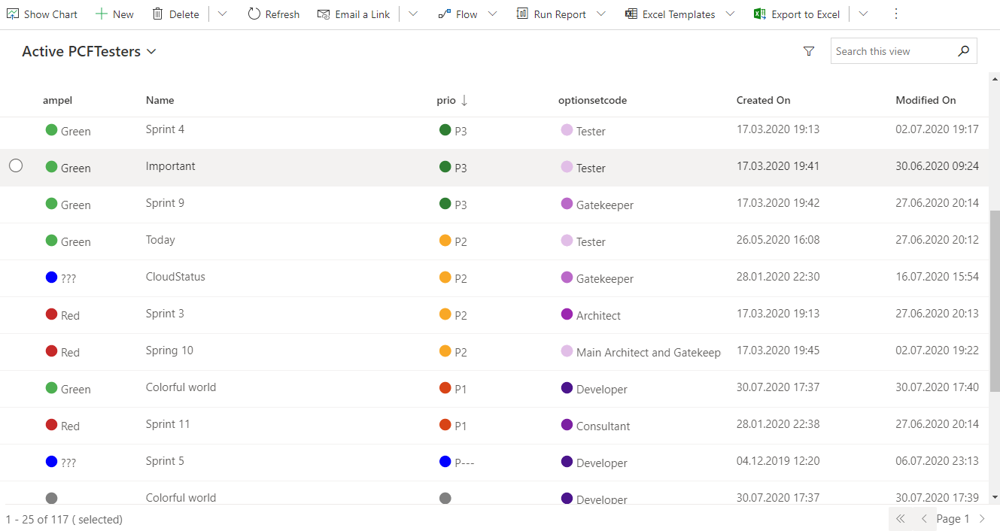
To achieve this you only have to attach the PCF to your view.
If you want to change the icon, just change the "Default Icon name" parameter to another icon.


### Colorful border and icon
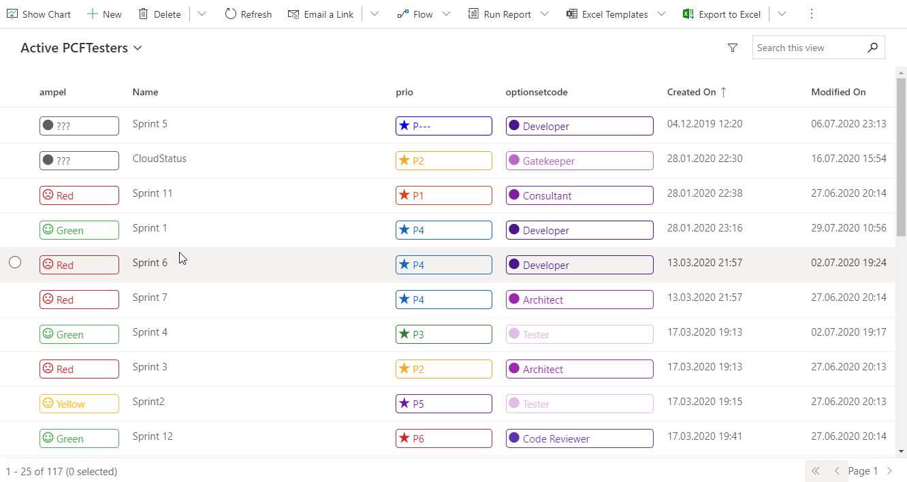
To have a colorful border and an icon you need the parameter combination:
- displayTypeText = "Colorful border"
- displayIconType = "Icon name or JSON"
The icon will be the "defaultIcon", unless you need more special config.
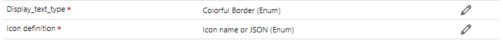

### Colorul background and icon
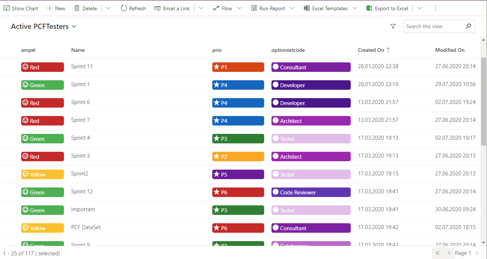
To have a colorful border and an icon you need the parameter combination:
- displayTypeText = "Colorful background"
- displayIconType = "Icon name or JSON"
The icon will be the "defaultIcon", unless you need more special config.
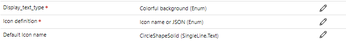

### Only Icon
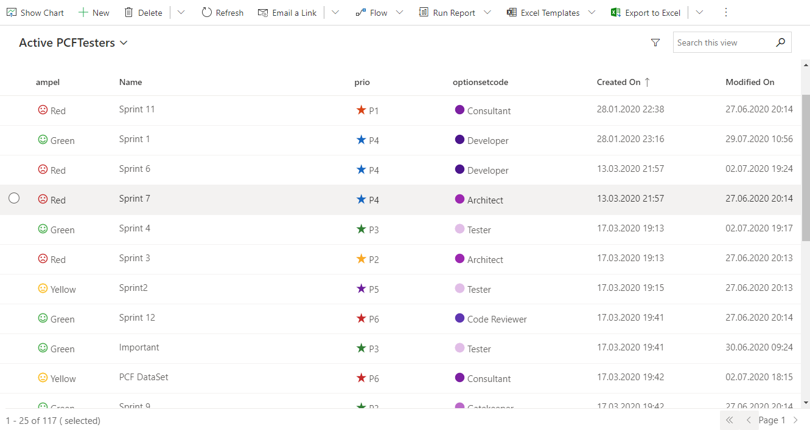
For this option, choose "Display text type": "No decoration"

### No Icon
Here you have two possibilities: the text with border, or the text with background. Similar to above, but choose "Icon definition" to "No icon"
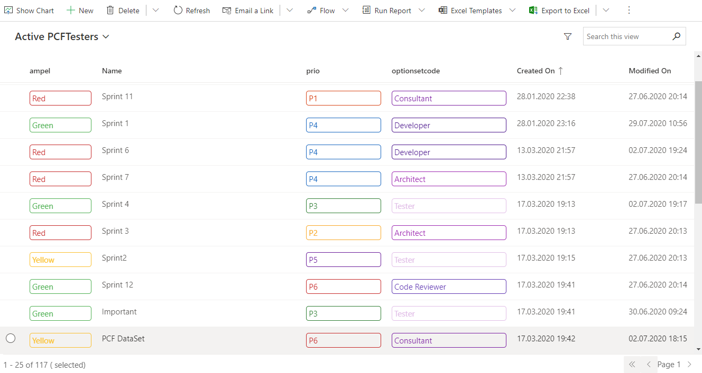


## Icons configuration
When the default icon is not enough, and you have to specify another icon per column, or in case you want to specify an icon per Optionset value, you need to define first the columns. You can specify up to 3 columns. Then the other columns will be ignored, and shown without colors.
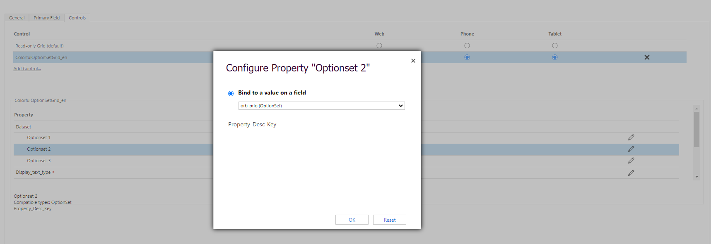

After you defined the column for "Optionset 1", the you can use the "iconConfig1" in order to define the icons. This can be the name of the icon, or you can use a JSON configuration for this.

If each value needs another icon, the you can paste a JSON in this field containing : "value" : {icon, color}. 
```javascript
{"434350002": {"icon": "Sad"}, "434350001": {"icon": "EmojiNeutral"}, "434350000":{"icon":"Emoji2"}, "434350003":{ "color": "black"}}
```
Icon and color doesn't have to be both defined. You can specify only the icon or only the color. 
Actually the color shouldn't be necessary at this point. I intend to have it more for CanvasApps later on. 

&#10071; The input length is limited to 100 char for now. So only a short JSON will pass. The next step will be to introduce the 3rd possibility for "Icon definition": "Environment variables". There the place is not limited, while they are solution aware.


If you need more columns, you can define "Optionset 2" and "iconConfig2" parameters. Proceed with the 3rs attribute, if needed.

&#10071; If only "Optionset x" is defined, but not the "iconConfig x", then the "Default icon name" will be used.


## Open isses:
- Translations
- Extend the icon definition to "Environment variables"
- Show lookups as hyperlinks
- Responsive UI (cards)
- CanvasApp


